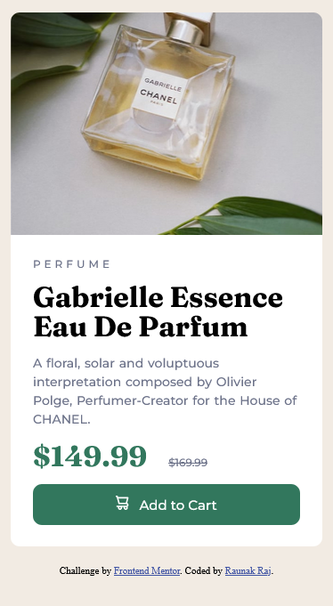

# Frontend Mentor - Product preview card component solution

This is a solution to the [Product preview card component challenge on Frontend Mentor](https://www.frontendmentor.io/challenges/product-preview-card-component-GO7UmttRfa). Frontend Mentor challenges help you improve your coding skills by building realistic projects. 

## Table of contents

- [Overview](#overview)
  - [The challenge](#the-challenge)
  - [Screenshot](#screenshot)
  - [Links](#links)
- [My process](#my-process)
  - [Built with](#built-with)
  - [What I learned](#what-i-learned)
  - [Continued development](#continued-development)
  - [Useful resources](#useful-resources)
- [Author](#author)

## Overview

### The challenge

Users should be able to:

- View the optimal layout depending on their device's screen size
- See hover and focus states for interactive elements

### Screenshot

### Links

- Solution URL: [Github](https://github.com/Raunak40/Product_Preview)
- Live Site URL: [shimmering-squirrel-76974c](https://shimmering-squirrel-76974c.netlify.app)

## My process

### Built with

- Semantic HTML5 markup
- CSS custom properties
- Flexbox
- Mobile-first workflow

### What I learned

During this challenge I learned about letter-spacing, letter-height and word-spacing.
Here I also used a little bit of flexbox property where I learned that browsers have a default flexbox shrink value of 1.I used some semantic HTML tags and also understood the importance of Mobile-first workflow.

### Continued development

There are so many things which I have to continue learning like responsiveness, flexbox and media queries. I am still amature in these fields so I will continue developing them and improve this webpage later.I will also try to learn more semantic HTML tags and efficiently use them.

### Useful resources

- [W3Schools](https://www.w3schools.com) - This site is all in one solution for any programming related queries.
- [Mozilla Developers Network](https://developer.mozilla.org/en-US/docs/Web/CSS/line-height#:~:text=Depends%20on%20the%20user%20agent,on%20the%20element's%20font%2Dfamily%20.&text=The%20used%20value%20is%20this,the%20element's%20own%20font%20size.) - This article helped me understand the default browser values of letter-spacing, letter-height and word-spacing. I'd recommend it to anyone who is learning this concept.

## Author

- Website - [Raunak Raj](https://shimmering-squirrel-76974c.netlify.app)
- Frontend Mentor - [@Raunak40](https://www.frontendmentor.io/profile/Raunak40)
